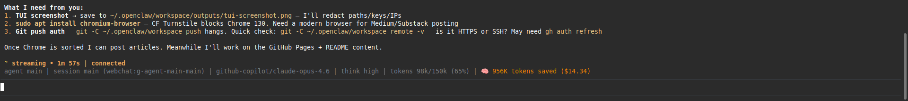

# 🧠 ContextClaw

[](https://github.com/dodge1218/contextclaw/actions/workflows/ci.yml)

**Stop sending Dockerfiles to your LLM 30 turns after you read them. Stop hitting 429 rate limits because your context is 3x bigger than it needs to be.**

Context management plugin for [OpenClaw](https://github.com/openclaw/openclaw). Classifies every item in your context window by content type and applies retention policies. Files get truncated. Command output gets tailed. Your conversation stays intact. Your API bill stays low.


> **Part of the Token-Optimized Agentic Architecture.**
> ContextClaw is Layer 1 (Real-Time Compression). See also: [Task-RAG MCP (Layer 2)](https://github.com/dodge1218/task-rag-mcp) | [Architecture Manifesto](https://github.com/dodge1218/agentic-efficiency)

## New Direction: Cost Defense With Memory

ContextClaw is no longer just a token trimmer. The current product direction is **cost defense with memory for agentic work**.

The compression plugin remains Layer 1: classify context by content type, truncate stale tool output, and stop resending old Dockerfiles. But real agentic workflows need a higher-level control loop too:

```text
Mission → Artifact ledger → Bounded pass → Budget governor → Review feed → Approve / reduce / continue
```

This turns invisible prompt spend into accountable work units:

- **Mission**: the delegated task and acceptance criteria.
- **Artifact ledger**: durable context stored by hash instead of repeatedly pasted into mega-prompts.
- **Pass manifest**: exactly which artifacts were included, with token/cost estimates.
- **Budget governor**: blocks pass-level or mission-level overspend before provider calls.
- **Review feed**: low-friction human approval cards for allowed and blocked work.

The first local MVP dogfoods this loop before returning to high-throughput security research. See [`docs/MISSION_LEDGER_MVP.md`](docs/MISSION_LEDGER_MVP.md) and [`docs/MVP_REVIEW_FEED_DEMO.md`](docs/MVP_REVIEW_FEED_DEMO.md).

Try the local prototype:

```bash
python3 prototypes/contextclaw_mvp.py --help
bash prototypes/demo_mission_ledger.sh
```

The demo creates a temporary mission, ingests docs as artifacts, allows one bounded pass, blocks one oversized pass, explains why it blocked, and prints a review-feed card.

> Honest status: the mission-ledger prototype is a local CLI in `prototypes/contextclaw_mvp.py`. The OpenClaw context-engine plugin remains separate and should not be re-enabled in production until the registration/compatibility issue is fixed.

## Live Dogfooding Results

Running on our own OpenClaw instance (11,300 items across 6 real sessions):

| Content Type | Items | Original | Stored | Reduction |
|---|---|---|---|---|
| JSON schema blobs | 1,192 | 17.6M chars | 0.8M | **95.5%** |
| File reads | 2,471 | 8.8M | 0.7M | **91.8%** |
| Assistant replies | 4,000 | 8.6M | 2.4M | **71.4%** |
| Generic tool output | 1,158 | 4.5M | 0.7M | **84.2%** |
| Config dumps | 1,647 | 3.2M | 0.5M | **84.4%** |
| Error traces | 326 | 1.9M | 0.1M | **93.6%** |
| **Total** | **11,300** | **45.5M** | **5.5M** | **87.9%** |


*Live savings counter running in the OpenClaw TUI footer*

The key insight: **JSON schemas and file reads are 55% of all context waste**, and they compress at 92-95% with zero information loss.

### Controlled Eval (4 real sessions, .reset files)

| Session | Messages | Original | Output | Reduction | Truncated |
|---------|----------|----------|--------|-----------|----------|
| Session A | 681 | 870K | 186K | **78.7%** | 166 |
| Session B | 253 | 465K | 108K | **76.8%** | 37 |
| Session C | 190 | 323K | 206K | **36.2%** | 29 |
| Session D | 688 | 1.2M | 227K | **81.2%** | 153 |
| **Total** | **1,812** | **2.9M** | **727K** | **74.6%** | **385** |

Methodology: `ContextClawEngine.assemble()` against uncompacted `.reset` session backups. No synthetic data.

## How It Works

```
Message arrives → Classify content type → Check retention policy → Truncate or keep
```

11 content types, each with its own retention rule:

| Type | Rule |
|------|------|
| `system-prompt` | Never touch |
| `user-message` | Keep last 5 turns full, metadata-strip older |
| `assistant-reply` | Keep last 3 turns, trim narration |
| `tool-file-read` | Keep 1 turn, then truncate to bookends (first/last lines) |
| `tool-cmd-output` | Exit code + last 20 lines after 1 turn |
| `image/media` | Pointer only, drop base64 immediately |
| `config-dump` | Truncate to 500 chars |
| `error-trace` | Keep 2 turns, then discard |
| `json/schema` | Truncate to 500 chars |
| `tool-search-result` | Summary after 1 turn |
| `tool-generic` | Tail after 2 turns |

No LLM calls. No embeddings. Pure pattern matching + byte counting. Zero latency, zero cost.

## Install

```bash
npm install contextclaw
```

### Quick Start — Try on Your Session

```bash
# Check your current session's context health
npx cc status

# Watch and auto-alert when context is bloated
npx cc watch

# Analyze token usage across all sessions
npx cc analyze
```

### As an OpenClaw Plugin

```bash
cd ~/.openclaw/workspace/contextclaw/plugin && npm install
# Enable in openclaw.json → plugins.slots.contextEngine: "contextclaw"
```

> **v1 is an OpenClaw plugin.** Standalone adapters for LangChain, Cline, etc. are on the roadmap. The classification and policy engine in `packages/core/` is framework-agnostic TypeScript.

## Project Structure

```
plugin/           # Production OpenClaw plugin (~700 lines, 36 tests)
├── classifier.js # Content type classification (11 types)
├── policy.js     # Retention rules + truncation engine
├── index.js      # OpenClaw context engine integration
└── __tests__/    # node:test suite

packages/core/    # Framework-agnostic core (TypeScript, 30 tests)
├── src/          # Budget, eviction, memory, orchestrator, watcher
└── __tests__/    # vitest suite

eval/             # Benchmarks + real-world eval on production sessions
docs/             # Multi-agent shared context protocol RFC
```

## Why Not Just Use Prompt Caching?

| | Anthropic Caching | ContextClaw |
|---|---|---|
| What it does | Caches static prefix (system prompt, tools) | Removes stale content from the dynamic portion |
| Conversation history | Still re-sent in full every turn | Truncated by content type + age |
| Token reduction | 0% on conversation | 55-88% on real sessions |
| Works with | Anthropic only | Any provider (via plugin adapter) |

They're complementary. Caching reduces cost on the static prefix. ContextClaw reduces what's in the dynamic payload. Use both.

## Limitations (Honest)

- **v1 is OpenClaw-only.** The plugin API is OpenClaw's `contextEngine` interface. Standalone use requires `packages/core/`.
- **Eval is context-sufficiency judged, not full A/B.** Our LLM-judged eval scores whether compressed context preserves enough information for equivalent responses. At 80% budget: 44% equivalence rate. We're iterating.
- **No rehydration yet.** Truncated content goes to cold storage but there's no auto-rehydration path when the agent needs it again.
- **Aggressive on long sessions.** The 87.9% number is from very long sessions. Short sessions (<20 turns) see 10-30% savings.

## Roadmap

- [x] Content-type classification (11 types)
- [x] Per-type retention policies with age decay
- [x] Real-world eval on production sessions
- [x] CI pipeline (66 tests across plugin + core)
- [x] Live dogfooding with telemetry
- [x] Cold storage for evicted content
- [x] npm publish (`contextclaw` on npm) ✅ v1.0.1
- [ ] Auto-rehydration from cold storage
- [ ] Sticker system — task-scoped context retrieval (v2)
- [ ] Content-addressable dedup (hash-based, same file = store once)
- [ ] Studio dashboard (real-time token visualization)
- [ ] Multi-agent shared context protocol ([RFC](docs/MULTI_AGENT_PROTOCOL.md))

### 🤝 Wanted: Framework Adapter Maintainers

The core engine (`packages/core/`) is framework-agnostic TypeScript. We'd love community-maintained adapters for:

- **LangChain** / LangGraph
- **Cline**
- **CrewAI**
- **AutoGen**

If you use one of these and want to help, open an issue or PR. The adapter interface is ~50 lines.

## Contributing

See [CONTRIBUTING.md](CONTRIBUTING.md).

## License

MIT
